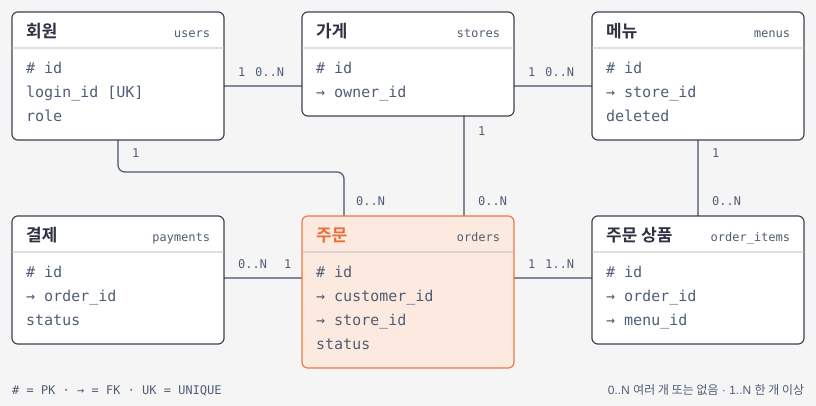
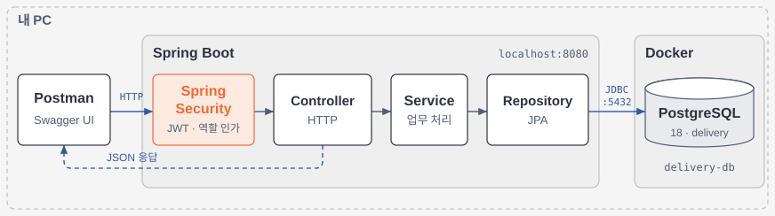

# Delivery

배달 주문 REST API.

## 문서

- [테이블 명세](docs/table-spec.md)
- [API 명세·Swagger UI](docs/api-spec.md)
- [동시성 처리](docs/concurrency.md)

## 설계

### ERD



결제의 0..N은 DB의 N:1 저장 관계입니다. 현재 API 흐름에서는 주문당 결제를 한 번 생성하며, 취소·거절한 주문의 재결제를 지원하지 않습니다.

전체 컬럼과 제약은 [테이블 명세](docs/table-spec.md)에 있습니다.

### 로컬 인프라



인증·인가 오류는 `SecurityErrorHandler`, Spring MVC의 요청 처리 오류는 `GlobalExceptionHandler`가 담당합니다. 응답 형식은 둘 다 `{status, message}`입니다.

## 실행

Java 21과 Docker가 필요합니다. 기존 DB 컨테이너는 다음 명령으로 시작합니다.

```bash
docker start delivery-db
```

컨테이너가 없는 새 환경에서만 생성합니다.

```bash
read -r -s SPRING_DATASOURCE_PASSWORD
export SPRING_DATASOURCE_PASSWORD

docker run --name delivery-db \
    -e POSTGRES_USER=delivery \
    -e POSTGRES_PASSWORD="$SPRING_DATASOURCE_PASSWORD" \
    -e POSTGRES_DB=delivery \
    -p 127.0.0.1:5432:5432 \
    -d postgres:18
```

`src/main/resources/application-local.yml`이 없으면 아래 내용으로 만들고 자리표시자를 바꿉니다. 이 파일은 Git에서 제외됩니다.

```yaml
spring:
  datasource:
    password: "YOUR_LOCAL_DB_PASSWORD"

jwt:
  secret: "YOUR_BASE64_JWT_SECRET"
```

JWT 키 생성:

```bash
openssl rand -base64 32
```

서버 실행:

```bash
./gradlew bootRun --args='--spring.profiles.active=local'
```

IntelliJ에서는 Project SDK·Gradle JVM을 Java 21로 설정하고 활성 프로필에 `local`을 지정합니다. API 주소는 `http://localhost:8080`이며 [Swagger UI](http://localhost:8080/swagger-ui.html)에서 요청을 실행할 수 있습니다.

## 테스트

DB 없이 테스트를 실행합니다:

```bash
./gradlew test
```
