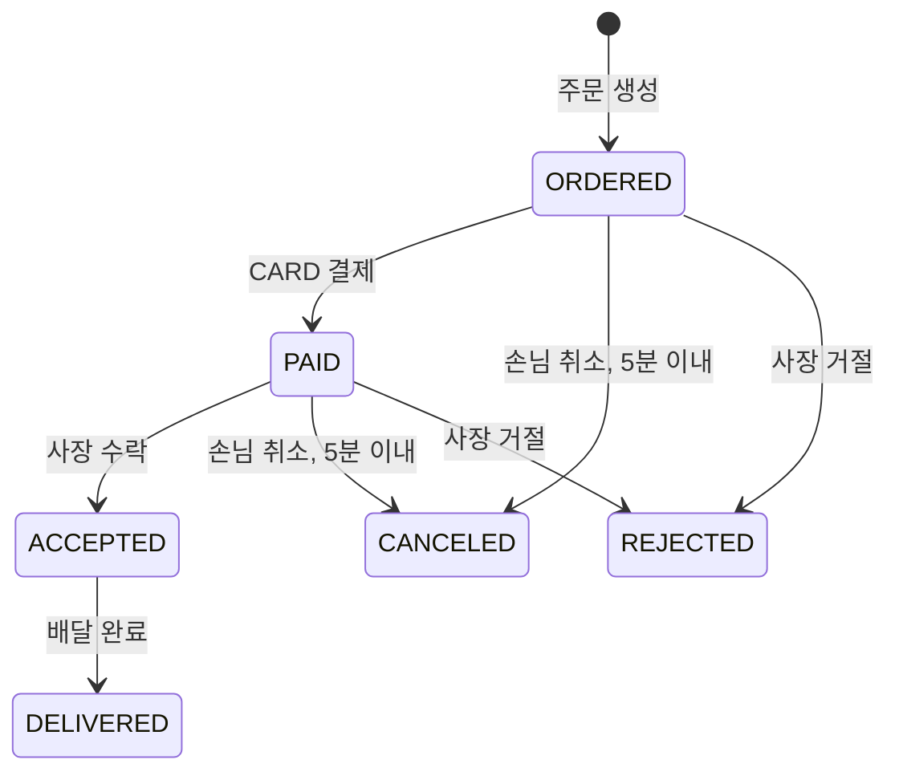

# API 명세

기본 주소는 `http://localhost:8080`입니다. 요청·응답은 JSON이며 본문이 있는 요청은 `Content-Type: application/json`을 보냅니다. 예시 ID·토큰·시각은 설명용입니다. 실제 응답으로 받은 ID와 토큰을 사용합니다.

## 공통 규칙

- 보호된 API: `Authorization: Bearer <token>`.
- 권한 OWNER·CUSTOMER는 서명 검증을 마친 JWT에서 읽습니다. 요청 본문에서 사장·손님 ID를 받지 않습니다.
- 역할이 맞아도 다른 사람의 가게·메뉴·주문에 접근하면 403입니다.
- 회원가입·로그인, 메뉴 목록·단건 GET은 토큰 없이 호출할 수 있습니다.
- 요청 본문의 ID·가격·수량은 정수 JSON 숫자입니다. `1.9`, `1.0`, `1e0` 같은 실수 표기를 정수 필드에 보내면 400입니다.
- `createdAt`은 서버 로컬 시간의 ISO-8601 문자열이며 시간대 오프셋을 포함하지 않습니다.
- 비밀번호·JPA 엔티티는 응답하지 않습니다. 생성은 201, 조회·수정·상태 전이는 200, 메뉴 삭제는 본문 없는 204입니다.

## API 목록

| Method | URL | 권한·범위 | 성공 | 응답 |
| --- | --- | --- | --- | --- |
| POST | `/api/users` | 공개 | 201 | UserResponse |
| POST | `/api/users/login` | 공개 | 200 | LoginResponse |
| POST | `/api/stores` | OWNER | 201 | StoreResponse |
| POST | `/api/menus` | OWNER, 본인 가게 | 201 | MenuResponse |
| GET | `/api/menus` | 공개 | 200 | PageResponse<MenuResponse> |
| GET | `/api/menus/{menuId}` | 공개, 활성 메뉴 | 200 | MenuResponse |
| PUT | `/api/menus/{menuId}` | OWNER, 본인 가게 | 200 | MenuResponse |
| DELETE | `/api/menus/{menuId}` | OWNER, 본인 가게 | 204 | 없음 |
| POST | `/api/orders` | CUSTOMER | 201 | OrderResponse |
| GET | `/api/orders` | CUSTOMER 본인 / OWNER 본인 가게 | 200 | OrderResponse 배열 |
| GET | `/api/orders/{orderId}` | CUSTOMER 본인 / OWNER 본인 가게 | 200 | OrderResponse |
| POST | `/api/orders/{orderId}/payments` | CUSTOMER, 본인 주문 | 201 | PaymentResponse |
| GET | `/api/payments` | CUSTOMER, 본인 주문의 결제 | 200 | PaymentResponse 배열 |
| PATCH | `/api/orders/{orderId}/accept` | OWNER, 본인 가게 | 200 | OrderResponse |
| PATCH | `/api/orders/{orderId}/deliver` | OWNER, 본인 가게 | 200 | OrderResponse |
| PATCH | `/api/orders/{orderId}/cancel` | CUSTOMER, 본인 주문 | 200 | OrderResponse |
| PATCH | `/api/orders/{orderId}/reject` | OWNER, 본인 가게 | 200 | OrderResponse |

가게 목록·단건 조회, 회원 정보 조회, 별도 결제 취소 URL은 현재 없습니다. 결제 취소는 주문 취소·거절에 포함됩니다.

## 1. 회원가입과 로그인

### POST /api/users

| 필드 | 타입 | 필수 | 검증 |
| --- | --- | --- | --- |
| loginId | String | O | 공백 불가, 4~20자, 중복 불가 |
| password | String | O | 공백 불가, 8자 이상, UTF-8 72바이트 이하 |
| role | String enum | O | OWNER / CUSTOMER |

```json
{
  "loginId": "demo-owner",
  "password": "example-password",
  "role": "OWNER"
}
```

201 응답:

```json
{"id": 1, "loginId": "demo-owner", "role": "OWNER"}
```

손님은 role에 `CUSTOMER`를 보냅니다. 검증 실패는 400, 아이디 중복은 409입니다. 같은 아이디의 동시 가입도 DB UNIQUE 위반을 409로 변환합니다.

### POST /api/users/login

`loginId`, `password`는 필수 문자열입니다. 비밀번호는 UTF-8 72바이트 이하여야 합니다. 로그인에는 role을 보내지 않습니다.

```json
{"loginId": "demo-owner", "password": "example-password"}
```

200 응답:

```json
{"token": "<JWT>"}
```

형식·검증 실패는 400, 없는 아이디나 틀린 비밀번호는 401입니다. 받은 토큰을 해당 사용자 요청의 Bearer 토큰으로 사용합니다.

## 2. 가게 생성

### POST /api/stores

OWNER 토큰을 사용합니다. `name`은 필수 문자열이며 공백 불가·255자 이하입니다. 사장 ID는 인증 정보로 정합니다.

```json
{"name": "김밥집"}
```

201 응답:

```json
{"id": 1, "name": "김밥집", "ownerId": 1}
```

검증 실패 400, 토큰 문제 401, CUSTOMER 접근 403입니다. 생성 응답의 id를 메뉴·주문 생성에 사용합니다.

## 3. 메뉴

### POST /api/menus

OWNER 토큰을 사용합니다.

| 필드 | 타입 | 필수 | 검증 |
| --- | --- | --- | --- |
| storeId | Long | O | 양수, 존재하는 본인 가게 |
| name | String | O | 공백 불가, 255자 이하 |
| price | Long | O | 1원 이상 정수 |
| description | String | X | 생략·null 허용 |

```json
{"storeId": 1, "name": "김밥", "price": 3000, "description": "기본 김밥"}
```

201 응답은 아래 MenuResponse입니다. 없는 가게 404, 다른 사장 가게 403, 입력 오류 400입니다.

### GET /api/menus

| 쿼리 | 타입 | 기본값 | 검증 |
| --- | --- | --- | --- |
| page | int | 0 | 0 이상, 0부터 시작 |
| size | int | 10 | 1~100 |

`page * size`가 `Integer.MAX_VALUE`를 넘으면 400입니다. 삭제되지 않은 메뉴를 `createdAt DESC, id DESC`로 정렬합니다. 마지막 페이지를 넘으면 빈 content와 전체 건수를 반환합니다. 다른 정렬 기준을 받는 sort 파라미터는 현재 없습니다.

```http
GET /api/menus?page=0&size=10
```

200 응답:

```json
{
  "content": [{"id": 1, "storeId": 1, "name": "김밥", "price": 3000, "description": "기본 김밥"}],
  "page": 0,
  "size": 10,
  "totalElements": 1,
  "totalPages": 1,
  "first": true,
  "last": true
}
```

### GET /api/menus/{menuId}

활성 메뉴 한 건의 MenuResponse를 200으로 반환합니다. 없거나 삭제된 메뉴는 404입니다.

### PUT /api/menus/{menuId}

OWNER·소유권 검사 후 `name`, `price`, `description`을 교체합니다. name·price는 생성과 같은 필수 검증입니다. storeId를 수정하는 필드는 없습니다.

```json
{"name": "야채김밥", "price": 3500, "description": "야채 추가"}
```

description을 생략하면 기존 설명은 null로 바뀝니다. 유지하려면 기존 값을 포함해 보냅니다. 성공 200, 입력 오류 400, 다른 사장 403, 없거나 삭제된 메뉴 404입니다.

### DELETE /api/menus/{menuId}

OWNER·소유권 검사 후 `deleted=true`로 표시하고 본문 없는 204를 반환합니다. 요청 본문은 없습니다. 다른 사장 403, 없거나 이미 삭제된 메뉴 404입니다.

삭제 후 메뉴 목록·단건·새 주문에서는 제외되지만 기존 주문 항목은 보존됩니다. 수정·삭제 동시 처리 규칙은 [동시성 문서](concurrency.md)에 있습니다.

## 4. 주문 생성·조회

### POST /api/orders

CUSTOMER 토큰을 사용합니다.

| 필드 | 타입 | 필수 | 검증 |
| --- | --- | --- | --- |
| storeId | Long | O | 양수, 존재하는 가게 |
| address | String | O | 공백 불가, 255자 이하 |
| items | 배열 | O | 1개 이상, null 항목 불가 |
| items[].menuId | Long | O | 양수, 삭제되지 않은 같은 가게 메뉴 |
| items[].quantity | Integer | O | 1~2,147,483,647 |

```json
{
  "storeId": 1,
  "address": "서울시 예시 주소",
  "items": [{"menuId": 1, "quantity": 2}]
}
```

서버가 메뉴 가격으로 금액을 계산하고 이름·단가를 주문 항목에 복사합니다. 초기 상태는 ORDERED입니다. 같은 menuId를 여러 항목으로 보내면 각각 저장합니다.

성공 201, 잘못된 입력·다른 가게 메뉴 혼합·금액 오버플로 400, 사장 역할 403, 없는 가게·메뉴 또는 삭제된 메뉴 404입니다.

### GET /api/orders

CUSTOMER는 본인 주문, OWNER는 본인 가게에 들어온 주문만 조회합니다. 빈 결과는 `[]`입니다. 성공 200이며 목록 정렬·페이징은 현재 지정하지 않았습니다.

### GET /api/orders/{orderId}

본인 손님 또는 대상 가게 사장만 조회할 수 있습니다. 성공 200, 타인 주문 403, 없는 주문 404입니다. 메뉴를 삭제해도 주문 당시 품목 정보는 그대로 반환합니다.

## 5. 결제 생성·조회

### POST /api/orders/{orderId}/payments

CUSTOMER의 본인 주문이고 상태가 ORDERED일 때만 가능합니다.

```json
{"method": "CARD"}
```

method는 필수이며 CARD만 지원합니다. amount를 클라이언트에서 받지 않고 주문 총액을 복사합니다. Payment의 초기 상태는 PAID이며 Order도 PAID로 바뀝니다. 외부 카드사 호출은 하지 않습니다.

성공 201, 형식·검증 오류 400, 타인 주문·사장 역할 403, 없는 주문 404, 이미 결제했거나 현재 상태에서 결제 불가하면 409입니다.

### GET /api/payments

CUSTOMER 본인 주문의 결제 내역만 `createdAt DESC`로 반환합니다. 성공 200, 내역이 없으면 `[]`입니다. 취소된 결제도 원래 amount와 CANCELED 상태로 표시합니다. OWNER는 403입니다.

## 6. 주문 상태 전이

아래 PATCH API는 요청 본문이 없습니다. 성공하면 변경된 OrderResponse를 200으로 반환합니다. 토큰 문제 401, 역할·소유권 불일치 403, 없는 주문 404, 불가능한 상태·기한은 409입니다.

| API | 허용 전 상태 | 후 상태 | 추가 조건 |
| --- | --- | --- | --- |
| PATCH /api/orders/{orderId}/accept | PAID | ACCEPTED | 본인 가게 OWNER |
| PATCH /api/orders/{orderId}/deliver | ACCEPTED | DELIVERED | 본인 가게 OWNER |
| PATCH /api/orders/{orderId}/cancel | ORDERED / PAID | CANCELED | 본인 CUSTOMER, 생성 시각부터 5분 이내 |
| PATCH /api/orders/{orderId}/reject | ORDERED / PAID | REJECTED | 본인 가게 OWNER, 5분 제한 없음 |

정확히 생성 후 5분인 시각까지 손님 취소가 가능합니다. PAID 취소·거절은 해당 Payment도 CANCELED로 바꿉니다. 결제 기록이 없거나 상태가 맞지 않으면 409로 거절하고 주문도 바꾸지 않습니다.

ACCEPTED·DELIVERED 주문의 취소·거절, 이미 취소·거절된 주문의 재결제·수락은 허용하지 않습니다. 수락·배달 완료·취소·거절의 허용 상태와 5분 경계는 이 구현에서 선택한 규칙입니다.



## 응답 DTO

| DTO | 필드 |
| --- | --- |
| UserResponse | id: Long, loginId: String, role: OWNER/CUSTOMER |
| LoginResponse | token: String |
| StoreResponse | id: Long, name: String, ownerId: Long |
| MenuResponse | id: Long, storeId: Long, name: String, price: long, description: String/null |
| OrderItemResponse | id: Long, menuId: Long, name: String, unitPrice: long, quantity: int, totalPrice: long |
| OrderResponse | id: Long, customerId: Long, storeId: Long, address: String, totalPrice: long, status: enum, createdAt: String, items: OrderItemResponse[] |
| PaymentResponse | id: Long, orderId: Long, amount: long, method: CARD, status: PAID/CANCELED, createdAt: String |
| PageResponse | content: 배열, page: int, size: int, totalElements: long, totalPages: int, first: boolean, last: boolean |

OrderResponse 예:

```json
{
  "id": 1,
  "customerId": 2,
  "storeId": 1,
  "address": "서울시 예시 주소",
  "totalPrice": 6000,
  "status": "ORDERED",
  "createdAt": "2026-10-08T12:00:00",
  "items": [{"id": 1, "menuId": 1, "name": "김밥", "unitPrice": 3000, "quantity": 2, "totalPrice": 6000}]
}
```

PaymentResponse 예:

```json
{"id": 1, "orderId": 1, "amount": 6000, "method": "CARD", "status": "PAID", "createdAt": "2026-10-08T12:01:00"}
```

## 오류 응답

```json
{"status": 400, "message": "수량은 1개 이상이어야 합니다."}
```

| 코드 | 의미 | 예 |
| --- | --- | --- |
| 400 | 형식·입력·도메인 규칙 오류 | 필수 값 누락, 소수 수량, 가게가 다른 메뉴 혼합 |
| 401 | 인증 실패 | 보호 API의 토큰 없음·만료·오류, 로그인 정보 불일치 |
| 403 | 권한·소유권 불일치 | CUSTOMER의 메뉴 등록, 타인의 주문 조회·결제 |
| 404 | 대상 자원 없음 | 없는 가게·주문, 없거나 삭제된 메뉴 |
| 405 | 지원하지 않는 HTTP 메서드 | 경로는 있으나 메서드가 다른 요청 |
| 409 | 중복 또는 상태 충돌 | 중복 가입·결제, 기한 초과, 잘못된 상태 전이 |
| 415 | 요청 Content-Type 오류 | JSON 본문을 다른 미디어 타입으로 전송 |
| 500 | 예상하지 못한 서버 오류 | 상세 내부 오류는 응답에 노출하지 않음 |

인증을 요구하는 API는 본문 검증보다 Security에서 먼저 401·403으로 차단될 수 있습니다. 보호 API의 인증 오류는 `WWW-Authenticate: Bearer`도 반환합니다. 검증 메시지의 순서는 고정된 API 계약으로 두지 않습니다.
