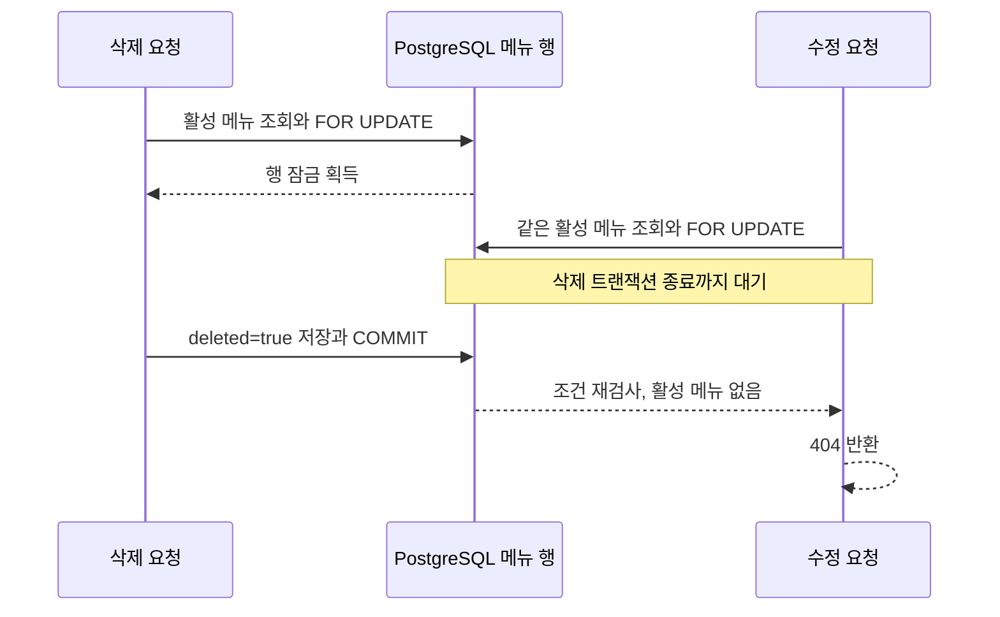

# 동시성 설계와 검증

동시성 개선은 과제의 추가 구현 선택입니다. 문서 작성이 권장인 것과, 구현 결함을 보완하는 것은 별도 항목으로 다룹니다.

## 메뉴 수정·삭제

### 수정 전 재현

두 트랜잭션이 모두 `deleted=false`인 메뉴를 먼저 읽으면, 삭제가 성공한 뒤 수정이 오래된 `deleted=false`까지 함께 저장할 수 있었습니다. 실제 API에서 DELETE 204와 PUT 200 이후 GET 200, DB의 `deleted=false`를 확인했습니다.

### 현재 처리

`MenuRepository.findWithLockByIdAndDeletedFalse`에 `PESSIMISTIC_WRITE`를 적용합니다. 수정과 삭제 모두 이 조회로 활성 메뉴를 읽고, 트랜잭션 종료까지 같은 행을 잠급니다. 일반 목록·단건 GET은 잠금 없는 조회를 유지합니다.



| 먼저 잠금을 획득한 작업 | 뒤의 작업 | 결과 |
| --- | --- | --- |
| 삭제 | 수정 | 삭제 204, 수정 404, 메뉴는 삭제 상태 |
| 수정 | 삭제 | 수정 200, 삭제 204, 수정한 값과 삭제 상태 모두 보존 |
| 수정 | 수정 | 순차 처리, 나중 수정 값 저장 |

위 결과는 PostgreSQL 기본 격리 수준인 READ COMMITTED를 기준으로 합니다. 이 수준의 `SELECT FOR UPDATE`는 대기 후 변경된 행의 조회 조건을 다시 검사합니다. 근거는 [PostgreSQL 18 공식 문서](https://www.postgresql.org/docs/18/transaction-iso.html#XACT-READ-COMMITTED)에 있습니다.

비관적 잠금은 트랜잭션 격리 수준을 SERIALIZABLE로 바꾸는 설정이 아닙니다. 같은 메뉴의 쓰기 작업을 해당 행에서 순차 처리합니다. 사용자 화면의 오래된 편집본 자체를 감지하는 버전 조건 API는 별도 설계이며 현재 넣지 않았습니다.

## 주문·결제

결제 생성과 주문 수락·배달 완료·취소·거절은 `OrderRepository.findWithLockById`로 같은 주문 행을 잠급니다. 잠금 획득 후 소유권과 현재 상태를 확인합니다. 취소·거절할 때 주문과 결제 상태 변경은 같은 트랜잭션에 들어갑니다.

주문당 결제 한 건은 `payments.order_id` UNIQUE가 마지막으로 보장합니다. 단위 테스트는 상태·소유권과 변환 규칙을 검증하며, 실제 DB 경합과 트랜잭션 동작은 별도로 검증해야 합니다.

## PostgreSQL 회귀 테스트

`MenuConcurrencyTest`는 `postgres` 태그로 일반 테스트에서 제외하고 `integrationTest`로만 실행합니다. 운영 DB 대신 스키마 생성 권한이 있는 개발·테스트용 PostgreSQL을 사용합니다. 테스트 연결은 READ COMMITTED로 고정합니다.

```bash
export DB_TEST_URL='jdbc:postgresql://localhost:5432/delivery'
export DB_TEST_USERNAME='delivery'
read -r -s DB_TEST_PASSWORD
export DB_TEST_PASSWORD
./gradlew integrationTest
```

환경변수가 없으면 태스크가 실패하여 실행 조건을 알립니다. 실행하지 않은 DB 테스트를 성공으로 표시하지 않습니다. 이 테스트는 추가 라이브러리나 새 Docker 컨테이너를 만들지 않습니다.

검증 순서는 다음과 같습니다.

1. `delivery_menu_lock_<무작위 값>` 스키마를 만들고 앱의 JPA 테이블·검증 데이터는 그 스키마에만 생성합니다.
2. 별도 JDBC 연결이 메뉴 행 잠금을 잡습니다.
3. 서로 다른 Service 트랜잭션 두 개를 실행하고, `pg_stat_activity`로 둘 다 실제 행 잠금에서 기다리는지 확인합니다.
4. 선행 잠금을 해제한 뒤 삭제→수정과 수정→삭제 두 경우를 검사합니다.
5. 공개 단건 조회가 404이고 DB 행이 `deleted=true`이며, 순서에 맞는 가격이 남았는지 확인합니다.
6. 종료 시 테스트가 만든 스키마만 삭제합니다. 기존 `public` 스키마의 데이터는 변경하지 않습니다.

테스트는 DB 연결에 5초, 소켓 응답에 15초, 잠금에 10초 제한을 두고 요청 대기·완료에도 제한을 둡니다. 프로세스를 강제 종료해 정리가 실행되지 않으면 이름이 `delivery_menu_lock_`으로 시작하는 테스트 스키마가 남을 수 있습니다. 실제 사용자 스키마를 수동으로 삭제하지 않습니다.

기본 검증은 `./gradlew test`로 실행합니다. DB 엔진에 연결할 수 없으면 기본 테스트와 소스 검토까지 가능하고, 실제 PostgreSQL 동시성 통과 여부는 `integrationTest` 실행 후에만 확정합니다.

## 이번 변경의 검증 결과 (2026-10-08)

| 검증 | 결과 |
| --- | --- |
| 기본 `test` | 134개 통과, 실패·오류·건너뜀 0개 |
| `integrationTest` | 2개 모두 DB 접속 타임아웃으로 Spring 초기화 단계에서 실패 |

DB 테스트는 스키마 생성 이전에 연결이 실패했습니다. 따라서 동시 실행 검증 본문은 실행되지 않았고, 기존 사용자 데이터도 변경하지 않았습니다. 메뉴 잠금 수정의 컴파일·단위 테스트는 통과했으나 실제 PostgreSQL 회귀 검증은 DB 연결 복구 후 남아 있습니다.
