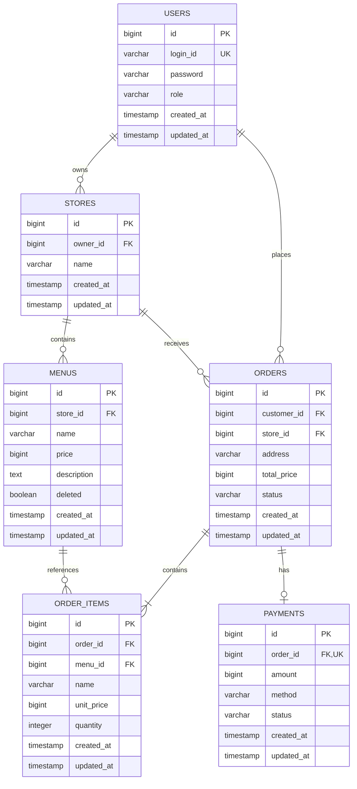

# ERD

현재 엔티티는 `User`, `Store`, `Menu`, `Order`, `OrderItem`, `Payment`의 6개입니다. `BaseEntity`는 공통 컬럼을 상속하는 `@MappedSuperclass`이므로 별도 테이블이 없습니다.

## 관계와 선택 이유

| 관계 | 의미와 구현 |
| --- | --- |
| User → Store, 1:N | 사장은 여러 가게를 가질 수 있습니다. `stores.owner_id`가 FK를 가집니다. |
| Store → Menu, 1:N | 메뉴의 가게 소속과 소유권을 표현합니다. `menus.store_id`가 FK를 가집니다. |
| User → Order, 1:N | 손님은 여러 번 주문할 수 있습니다. `orders.customer_id`가 FK를 가집니다. |
| Store → Order, 1:N | 주문의 대상 가게를 고정합니다. 다른 가게의 메뉴를 한 주문에 섞을 수 없습니다. |
| Order → OrderItem, 1:N | API는 1개 이상 항목을 요구합니다. `order_items.order_id`로 주문에 연결합니다. |
| Menu → OrderItem, 1:N | 메뉴는 여러 주문에서 참조됩니다. 삭제 후에도 주문 기록과 FK가 유지됩니다. |
| Order → Payment, 1:0..1 | 결제 전에는 기록이 없고, 주문별 `payments.order_id` UNIQUE로 한 건만 허용합니다. |

역할에 따른 사장·손님 동작은 Spring Security에서 제한하고, 개별 자원의 소유권은 Service에서 확인합니다. FK 자체가 사용자 역할을 검사하는 것은 아닙니다.

연관관계 7개는 FK를 가진 쪽에서 `@ManyToOne(fetch = LAZY)`로 단방향 참조합니다. Payment도 JPA 매핑은 `@ManyToOne`이지만 FK의 UNIQUE 제약 때문에 저장된 관계는 주문당 최대 한 건입니다. 컬렉션 양방향 매핑 대신 Repository로 주문 항목을 조회합니다.

## 주문 당시 정보를 보존하는 이유

`OrderItem.name`과 `OrderItem.unitPrice`는 주문 생성 시 메뉴 값을 복사한 정보입니다. 메뉴 이름·가격을 수정해도 이전 주문의 품목·금액은 바뀌지 않습니다. `Order.totalPrice`와 `Payment.amount`도 생성 시 계산·복사합니다.

메뉴 삭제는 `deleted=true`로 표시합니다. 공개 조회와 새 주문에서는 삭제된 메뉴를 제외하지만, 기존 주문의 `menu_id`와 주문 항목은 유지합니다.

Store·OrderItem 분리는 과제의 도전 기능에 해당합니다. 단방향 관계, 정수 PK, 주문 시점 정보 복사와 컬럼명은 이 구현에서 선택한 설계입니다. 세부 컬럼은 [테이블 명세](table-spec.md)를 확인합니다.
