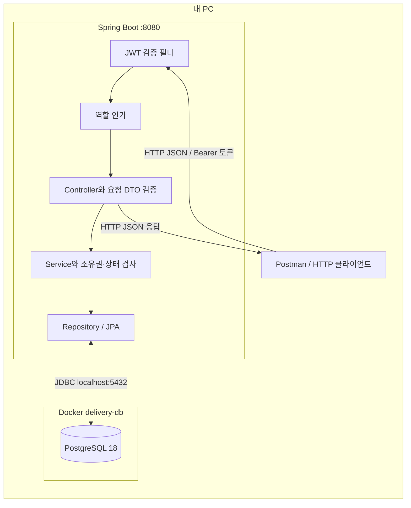

# 로컬 인프라 구성

이 프로젝트는 내 PC에서 실행하는 단일 Spring Boot 서버입니다. 사장과 손님은 같은 API 서버를 사용하고 JWT의 역할로 권한을 구분합니다. 별도 사장 서버·손님 서버나 외부 게이트웨이는 두지 않았습니다.

## 요청 처리

1. JWT 필터가 서명·만료·사용자 식별자·역할을 검증하고 SecurityContext에 인증 정보를 넣습니다.
2. Spring Security가 API별 OWNER·CUSTOMER 역할을 검사합니다. 회원가입·로그인과 메뉴 GET은 공개입니다.
3. Controller가 `@Valid` 요청 DTO를 검증하고 Service를 호출합니다.
4. Service가 자원 소유권·주문 상태·취소 기한을 검사하고 트랜잭션을 관리합니다.
5. Repository가 PostgreSQL을 조회·저장합니다. Controller는 엔티티 대신 DTO를 JSON으로 반환합니다.

인증 필터·인가 단계의 401·403은 `SecurityErrorHandler`가 처리합니다. Controller 이후 오류는 `GlobalExceptionHandler`가 처리합니다. 두 경로 모두 `{status, message}` 형식입니다.

## 연결과 비밀 설정

| 항목 | 기본값·보관 위치 |
| --- | --- |
| HTTP | localhost:8080 |
| DB | localhost:5432/delivery |
| DB 사용자 | delivery |
| 실제 DB 비밀번호 | Git에서 제외한 application-local.yml 또는 환경변수 |
| 실제 JWT 키 | Git에서 제외한 application-local.yml 또는 환경변수 |
| JWT 만료 | 공통 application.yml, 3,600,000ms |

Docker를 쓰지 않고 PC에 설치한 PostgreSQL로 연결해도 API 계층은 같습니다. 이미 설치된 서버가 5432를 사용하면 컨테이너의 호스트 포트와 JDBC URL을 함께 변경합니다. 컨테이너 내부 PostgreSQL 포트는 5432입니다.

배포·외부 결제사·API Gateway는 현재 구성에 포함되지 않습니다. 실행 절차는 [README](../README.md), 트랜잭션과 잠금은 [동시성 문서](concurrency.md)에 있습니다.
